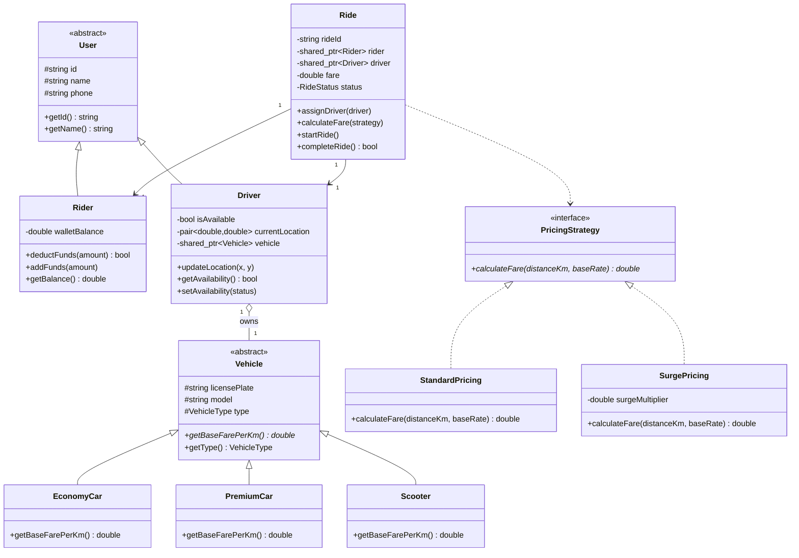

# Ride-Sharing System Simulation (C++ OOP)

A modular, Object-Oriented Ride-Sharing System Simulation built in **C++17**. The project models real-world ride-hailing services (like Uber/Careem) applying core software engineering design patterns, object-oriented principles, and dynamic data loading via file I/O (`CSV`).

---

## Key Features

- **Object-Oriented Architecture:** Pure implementation of Inheritance, Polymorphism, Encapsulation, and Abstraction.
- **Factory & Strategy Patterns:** Dynamic pricing calculation (Standard vs. Surge) and polymorphic vehicle instantiation.
- **Data Persistence (CSV Parsing):** Separates system state/configuration from logic by loading `Rider` and `Driver` records directly from external `.csv` files.
- **Nearest Driver Matching:** Spatial location-based matching algorithm filtering available drivers by vehicle category.
- **Wallet & Transaction Management:** Safe ride execution with automatic wallet deduction and driver availability resets.

---

## Class Diagram (UML)



---

## Build and Run Instructions

### Compilation Commands

```powershell
g++ main.cpp -o main -lmingw32
.\main
```
